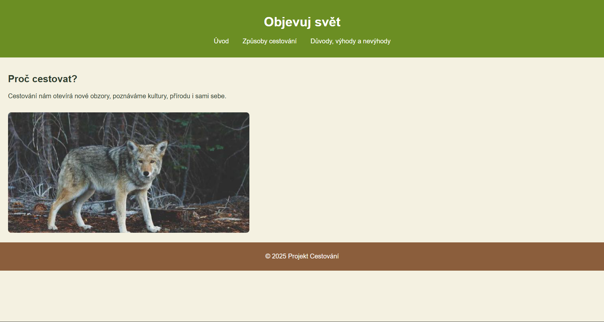
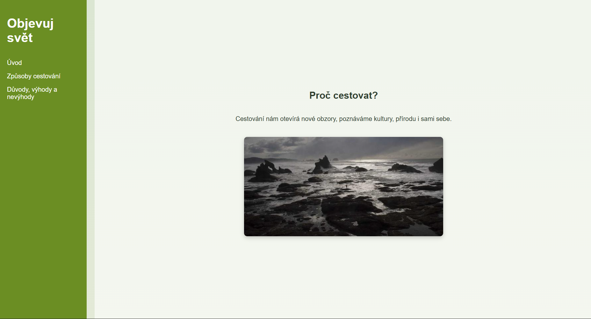

# cestovani# Projekt: Web o cestování 🌍

## AI použité k vytvoření
 MS Copilot

## PROMPTY a postupné výsledky
1. Ahoj, dělám projekt webových stránek na téma cestování. Potřebuji vytvořit kód html a styly, aby webovka měla minimálně tři stránky (úvod, způsoby, důvody, výhody, nevýhody) a aby stránka obsahovala nějaké ty obrázky a přírodní barvy
- 

2. hej super dobrý start teď to přepiš akorát tak aby ta index.html měla v sobě sekce ty způsoby důvody apod. a do nich dej pár základních věcí s obrázky a k tomu potom přidej odkaz více, který zavede na tu danou stránku zpusoby duvody, zmenši navbar objevuj svět dej do levého kraje odkazy na sekce do levého kraje a zvětš sekce aby to bylo fakt stránka od stránky pls
- 

3. tak joo už se dostáváme dál super, teď bych dodal možná barvu do pozadí protože ta bílá mi tam nesedí aleeee dodal bych možná ještě animace (jakože to sjede k další sekci)
- přidání animace aby to sjíždělo k sekcím.

4. super prosím jenom zmenši obrázky aby bylo vidět tlačítko s odkazy a přidej odkazy na sekce způsoby a důvody ještě do té sekce úvod
- zmenšení obrázků dodání pár tlačítek do sekce úvod

5. tak super s index.html stránkou jsem spokojený. Nyní je čas upravit stránky způsoby a důvody. Do navbaru bych možná dal tak akorát ten úvod ať se můžeme vrátit na hlavní stránku a jinak bych to rozvedl jak můžeme cestovat třeba aji jakože přes erasmus nebo cestovky a zase bych to rozdělil na sekce doprava a možnosti, v dopravě bude způsob jakým se na místo dostaneme (auto, vlak...) a možnosti (na vlastní ruku, cestovka, erasmus, dobrovolnictví, za někým,...) a do důvodů bych dal něco jako výhody (poznání nové kultury, lidí, řeč, zvyky, příroda, sporty,...) nevýhody (daleko od kamarádů, rodiny, práce, finance)
- doplnění stránek způsoby a důvody přidání odkazů 

## proběhlo ještě pár úprav stránek se kterou jsem spokojený